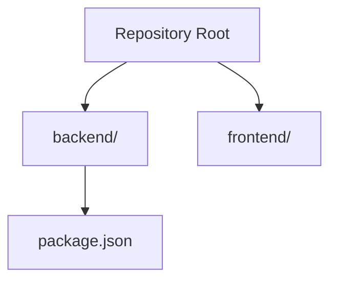
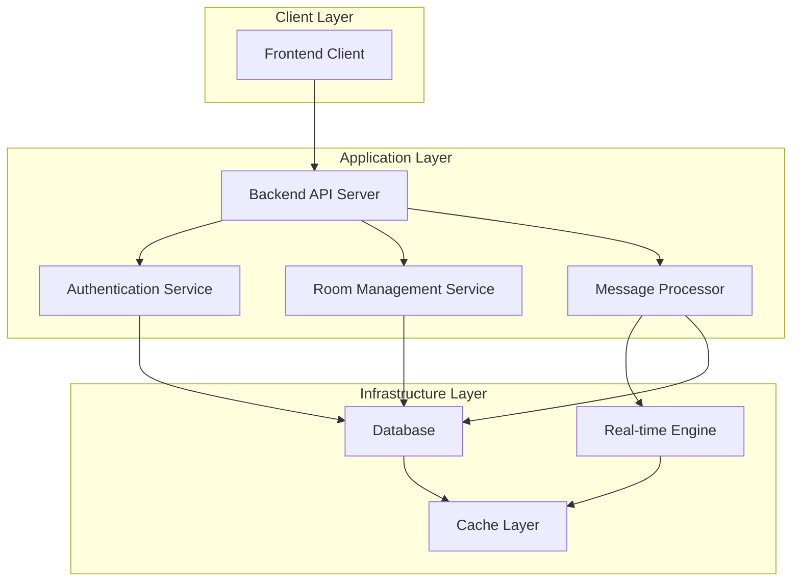
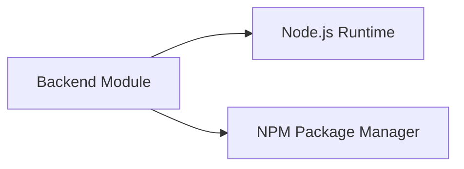

# Project Overview

<cite>
**Referenced Files in This Document**
- [package.json](file://backend/package.json)
</cite>

## Table of Contents
1. [Introduction](#introduction)
2. [Project Structure](#project-structure)
3. [Core Components](#core-components)
4. [Architecture Overview](#architecture-overview)
5. [Detailed Component Analysis](#detailed-component-analysis)
6. [Dependency Analysis](#dependency-analysis)
7. [Performance Considerations](#performance-considerations)
8. [Troubleshooting Guide](#troubleshooting-guide)
9. [Conclusion](#conclusion)

## Introduction
This document provides a comprehensive overview of the Chat Application project, a real-time chat messaging system designed to enable instant communication between users. The application targets end users who require reliable, low-latency messaging capabilities, along with developers building scalable chat infrastructure. Its core objectives include facilitating seamless real-time conversations, managing user identities and sessions, and delivering robust communication channels with extensible architecture.

Key goals:
- Real-time messaging with immediate delivery guarantees
- Scalable user management and session handling
- Modular architecture supporting future feature expansion
- Developer-friendly setup and deployment processes

## Project Structure
The repository currently contains a minimal backend structure with a package manifest indicating a Node.js-based backend module. The frontend directory is present but empty, suggesting the frontend implementation is pending or external to this repository snapshot.

**Diagram sources**
- [package.json:1-13](file://backend/package.json#L1-L13)

**Section sources**
- [package.json:1-13](file://backend/package.json#L1-L13)

## Core Components
The project’s foundational components align with a typical real-time chat architecture:

- Backend service: Hosts APIs for user authentication, chat room management, and real-time message routing. It exposes endpoints for user registration, login, and chat operations while integrating with a real-time engine for bidirectional communication.
- Real-time engine: Manages WebSocket connections to deliver low-latency message propagation across clients. It handles connection lifecycle, message broadcasting, and presence updates.
- Frontend client: Provides user interface for chat interactions, including message composition, room navigation, and real-time updates. It connects to the backend via WebSocket and renders incoming messages instantly.
- Database layer: Stores user profiles, chat history, and metadata. It supports efficient querying for user relationships, room membership, and historical message retrieval.
- Authentication and authorization: Enforces secure access through token-based sessions, validating user credentials and enforcing permissions for chat rooms and actions.

Common use cases:
- User registration and login to establish authenticated sessions
- Creating or joining chat rooms for group conversations
- Sending and receiving real-time messages with read receipts
- Managing user presence and typing indicators
- Viewing chat history and searching past messages

## Architecture Overview
The system follows a layered architecture with clear separation of concerns:

Conceptual flow:
- Clients connect to the backend via WebSocket for real-time updates.
- The API server authenticates requests and routes them to appropriate services.
- Room management services handle membership and permissions.
- Message processing services persist and broadcast messages.
- Database and cache layers support fast reads and writes.

## Detailed Component Analysis

### Backend API Server
Responsibilities:
- Expose REST endpoints for user and room operations
- Integrate with the real-time engine for live messaging
- Coordinate with authentication and room management services

Implementation considerations:
- Use middleware for request validation and rate limiting
- Implement graceful error handling and logging
- Ensure CORS configuration for cross-origin frontend access

### Real-time Engine
Responsibilities:
- Manage WebSocket connections and handle connection events
- Broadcast messages to subscribed clients
- Track user presence and room occupancy

Implementation considerations:
- Implement heartbeat mechanisms to detect stale connections
- Use connection pooling and efficient message queuing
- Apply backpressure strategies during high-load scenarios

### Authentication Service
Responsibilities:
- Validate user credentials and issue secure tokens
- Enforce session lifetimes and refresh policies
- Protect endpoints with role-based access controls

Implementation considerations:
- Use industry-standard hashing for passwords
- Implement token revocation and rotation
- Add multi-factor authentication support as an extension

### Room Management Service
Responsibilities:
- Create and manage chat rooms with configurable permissions
- Handle user invitations and membership changes
- Maintain room metadata and activity logs

Implementation considerations:
- Support dynamic room configurations (public/private, invite-only)
- Implement audit trails for administrative oversight
- Optimize queries for large-scale room operations

### Message Processor
Responsibilities:
- Persist messages to storage and index for search
- Enforce message filtering and moderation policies
- Deliver real-time notifications to subscribers

Implementation considerations:
- Implement deduplication and ordering guarantees
- Support message threading and replies
- Provide message search and retrieval APIs

## Dependency Analysis
The backend module declares a minimal set of dependencies, indicating a lightweight foundation for the chat application. The current package manifest does not define runtime dependencies, leaving room for framework selection based on project requirements.

**Diagram sources**
- [package.json:1-13](file://backend/package.json#L1-L13)

**Section sources**
- [package.json:1-13](file://backend/package.json#L1-L13)

## Performance Considerations
- Connection scaling: Use connection pooling and load balancing to handle concurrent WebSocket connections efficiently.
- Message throughput: Implement batching and compression for high-volume message streams.
- Storage optimization: Index frequently queried fields and partition data for large datasets.
- Caching strategy: Cache hot data (active rooms, recent messages) to reduce database load.
- Monitoring: Instrument latency metrics for real-time operations and set up alerting for degraded performance.

## Troubleshooting Guide
Common issues and resolutions:
- Connection failures: Verify WebSocket endpoint availability and network connectivity. Check firewall rules and reverse proxy configurations.
- Authentication errors: Confirm token validity and expiration. Review session storage and cookie settings.
- Message delivery delays: Monitor real-time engine queue depth and worker capacity. Investigate database write performance.
- Memory leaks: Profile memory usage and ensure proper cleanup of event listeners and timers.
- Scaling bottlenecks: Analyze CPU and I/O utilization. Consider horizontal scaling and database sharding.

## Conclusion
The Chat Application project establishes a solid foundation for a real-time messaging platform. With clear separation of concerns, modular architecture, and extensible design, it supports rapid development of advanced chat features. The current structure provides flexibility for technology stack selection while maintaining developer productivity. Future enhancements should focus on comprehensive testing, performance tuning, and security hardening to meet production-grade requirements.